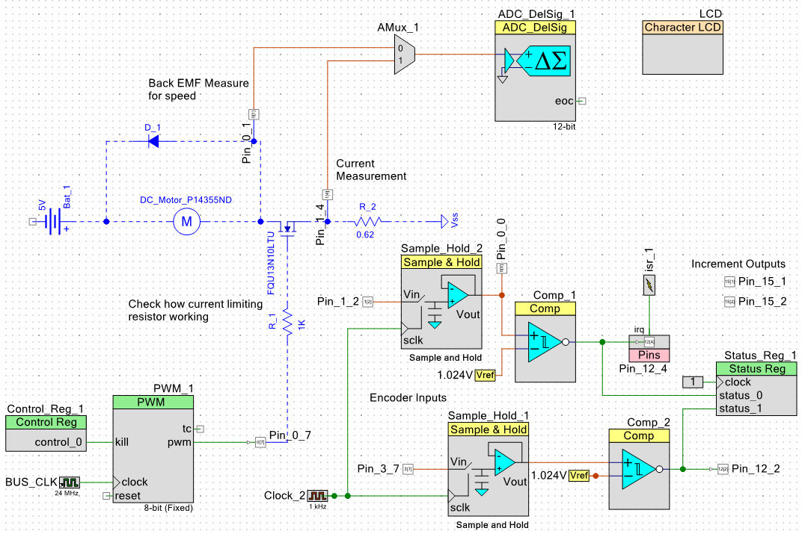

# Motor_Control_Experiment
Experiment to implement a motor controller from a Cypress Semiconductor PSOC5 and basic electrical components

## Current_Circuit_Design

## Manual_Rotary_Encoder
Inputs read with comparators to convert analog signals from the encoder to digital signals for use in the controller.

Sample and hold devices used with 1kHz sample rate to filter out high frequency analog noise generated by the mechanical contacts within the encoder.

### Issues
At a frequency of about 1/10 notches, reading the encoder registers a positive increment instead of negative when rotating CCW. Haven't determined the source of the problem, but it could be because the falling edge of the 'lead' signal occurs at nearly the same instant or possible even behind the trailing signal.The interrupt service routine that sample the encoder signals triggers on the falling edge of the red signal below.

