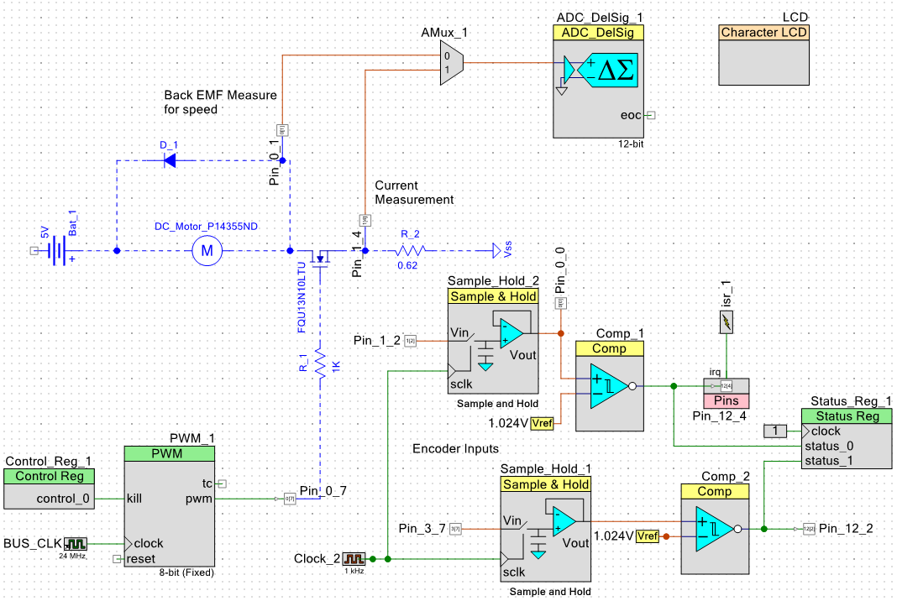
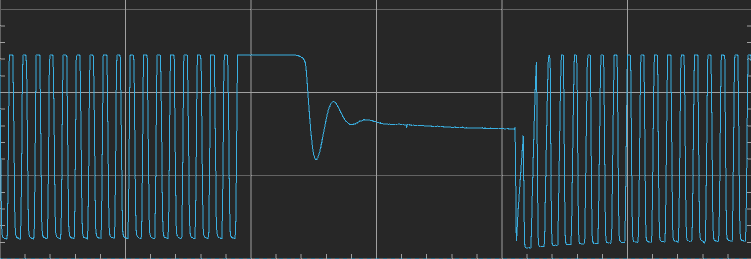
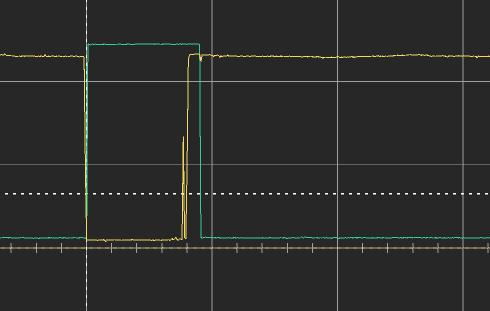
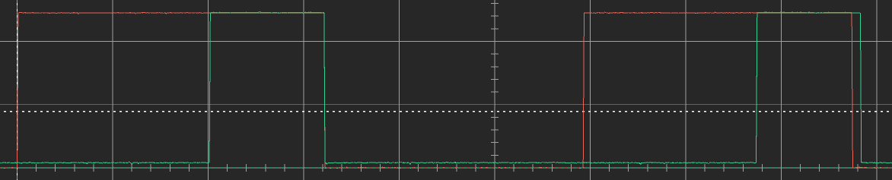

# Motor_Control_Experiment
Experiment to implement a motor controller from a Cypress Semiconductor PSOC5 and basic electrical components

## Current_Circuit_Design


## Speed_From_BackEmf
A simple motor can be thought of as an inductor, resistor and back emf voltage source all in series. The voltages from the inductor, resistor, and back emf all oppose the supplied voltage to the motor:

(insert picture of simple motor circuit)

V_supply - V_L - V_R - V_bemf = 0

The opposing voltage of the inductor is due to a varying current in time:

V_L = L * di/dt 

Once the current reaches steady state, di/dt becomes zero and therefore V_L becomes zero.

(equation for the time constant of inductance settling - Current or RL circuit with step input)

The voltage settling time for the P14355ND motor currently used the experiment is ~100 microseconds. Therefore the code waits 200 microseconds to allow some additional buffer before taking the voltage reading for back emf. 

```C
/**
*Calculates back emf in mV using supply voltage as a reference
*@param v_supply_mv int16 voltage supplied to the motor
*
*returns back_emf_mv int16 back emf voltage in mv
*/
static int16 read_back_emf(int16 v_supply_mv){
    Control_Reg_1_Write(1);
    CyDelayUs(200);
    AMux_1_Select(0);
    ADC_DelSig_1_StartConvert();
    ADC_DelSig_1_IsEndConversion(ADC_DelSig_1_WAIT_FOR_RESULT);
    CyDelayUs(5); // add delay for conversion to complete
    Control_Reg_1_Write(0);
    int32 back_emf_counts = (int32)ADC_DelSig_1_GetResult16();
    return(v_supply_mv - ADC_DelSig_1_CountsTo_mVolts(back_emf_counts));
}
```

The following readout from the oscilliscope at the location of Pin_0_1 is at a time scale of 100 microseconds per division:


The voltage drop across the resistance of the motor also only applies when current is flowing:

V_R = I * R

The ground path from the motor can be removed to assist in measuring the back emf. This will cause a short voltage and current spike as the inductance of the motor will oppose the sudden drop in current from the voltage supply. A flyback diode will allow the current from the motor inductance to safely dissipate.

Waiting long enough for the current to dissipate and reach steady state allows the measured voltage of the circuit become:

V_supply - V_bemf = V_measured

V_bemf = V_measured - V_supply

The external voltage needs to be considered as it is still connected to the motor circuit even after the ground path is removed.

Then the speed constant of the motor (Ke) can be used in combination with the back emf voltage to calculate the speed. 

motor_speed = V_bemf / K_e

K_e is a constant property of the motor based on its winding design and is typically included in the motor spec. In an ideal motor where L=0, R=0 and no mechanical losses occur, K_e will be equal to the supplied motor voltage over the max rotational speed in a no-load state. That is because in the ideal scenario, the back emf would be the only opposition to the supply voltage and the only thing limiting the motor's speed.


## Manual_Rotary_Encoder
Inputs read with comparators to convert analog signals from the encoder to digital signals for use in the controller.

Sample and hold devices used with 1kHz sample rate to filter out high frequency analog noise generated by the mechanical contacts within the encoder.



### Issues
At a frequency of about 1/10 notches, reading the encoder registers a positive increment instead of negative when rotating CCW. Haven't determined the source of the problem, but it could be because the falling edge of the 'lead' signal occurs at nearly the same instant or possible even behind the trailing signal.The interrupt service routine that sample the encoder signals triggers on the falling edge of the red signal below.

